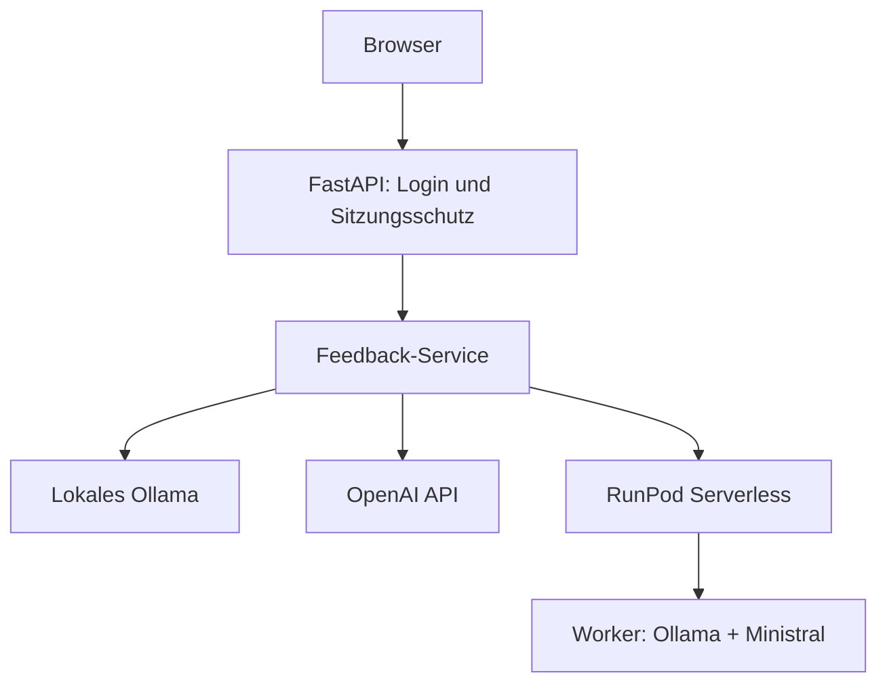

# KI-Schreibfeedback-Prototyp 0.4

Web-App-Prototyp zur geschützten, vergleichenden Erzeugung von Schreibfeedback mit einem lokal betriebenen Ollama-Modell, der OpenAI API und einem selbst betriebenen Ministral-Modell über RunPod Serverless.

> **Aktueller Projektstand: Version 0.4.** Serverseitige Anmeldung, Sitzungsschutz, Login-Begrenzung und CSRF-Schutz sind implementiert und automatisiert getestet. Das öffentliche Online-Deployment ist noch nicht Bestandteil dieser Version.

## Versionsstand und Ziel

| Version | Status | Inhalt |
|---|---|---|
| **0.3** | abgeschlossen | Provider-Auswahl für Ollama, OpenAI und RunPod, RunPod-Worker, Konfiguration und automatisierte Tests |
| **0.4** | aktuell | Serverseitige Anmeldung, geschützte Web- und Modellrouten, sichere Sitzungen, Login-Begrenzung und CSRF-Schutz |
| **0.5** | Online-Ziel | Geschützte und getestete Bereitstellung der Web-App auf DigitalOcean und des Modells auf RunPod |

Version 0.4 ist damit ein funktionsfähiger, lokal getesteter Sicherheitsstand, aber noch nicht für eine frei erreichbare Bereitstellung vorgesehen. Weitere Funktionen und Designänderungen können nach Version 0.5 in nachfolgenden Versionen ergänzt werden.

## Architektur



Die Startseite, die Analysefunktion und die Ollama-Modellabfrage sind nur nach erfolgreicher Anmeldung erreichbar. Zugangsdaten werden serverseitig gegen einen Argon2-Passworthash geprüft. Der RunPod-API-Key und die RunPod-Endpoint-ID werden ausschließlich serverseitig aus der `.env` gelesen und nicht an den Browser übertragen.

Für OpenAI kann ebenfalls ein serverseitiger Standard-Key in der `.env` hinterlegt werden. Version 0.4 erlaubt für lokale Entwicklungstests zusätzlich die einmalige Eingabe eines alternativen OpenAI-Keys im Browser. Dieser wird nicht gespeichert oder erneut angezeigt, aber an das FastAPI-Backend übertragen. Diese lokale Testfunktion ist nicht für ein öffentliches Deployment vorgesehen und wird vor dem Onlinegang entfernt oder geschützt.

## Funktionsumfang von Version 0.4

- serverseitige Anmeldung mit einem konfigurierbaren Prüferkonto
- Argon2-Passworthash statt Klartextpasswort in der Konfiguration
- signierte Sitzungscookies mit begrenzter Gültigkeit, `HttpOnly` und `SameSite=Lax`
- Zugriffsschutz für Startseite, Analyse und Ollama-Modellabfrage
- Begrenzung wiederholter fehlgeschlagener Loginversuche pro erkanntem Client
- CSRF-Schutz für Login, Logout und Analyseformular
- Eingabe eines anonymisierten, abgetippten Beispieltexts
- Auswahl zwischen lokalem Ollama, OpenAI und RunPod Serverless
- konfigurierbare Standardmodelle für alle drei Provider
- dynamisches Laden der lokal installierten Ollama-Modelle
- optionale Modell-ID für künftige oder nicht aufgelistete Ollama- und OpenAI-Modelle
- optional änderbare Ollama-API-Adresse für die lokale Entwicklung
- optionaler OpenAI-Key für einen einzelnen lokalen Testaufruf
- asynchrone RunPod-Aufträge mit Statusabfrage, Zeitlimit und Abbruch bei Zeitüberschreitung
- eigener RunPod-Worker mit Ollama und eingebettetem Ministral-Modell
- Validierung von Modell, Eingabe, Ausgabeformat und erlaubten Generierungsoptionen im Worker
- Anzeige von Provider, tatsächlich verwendetem Modell und Gesamtdauer
- verständliche Fehlermeldungen bei fehlender Konfiguration oder nicht erreichbaren Providern
- Registry-, Modellkatalog-, Metrik- und SQLite-Architektur als Grundlage für weitere Ausbaustufen

## Projektstruktur

| Pfad | Aufgabe |
|---|---|
| `app/` | FastAPI-Web-App, Provider-Adapter, Services, Templates und statische Dateien |
| `config/models.yaml` | Deklarativer Provider- und Modellkatalog |
| `runpod_worker/` | Docker-Image, Serverless-Handler, Worker und Testeingabe für RunPod |
| `tests/` | Automatisierte Tests für Browserauswahl, RunPod, Anmeldung, Sitzungen, Login-Begrenzung und CSRF-Schutz |
| `scripts/` | Zusätzliche Architektur- und Verbindungsprüfungen |

## Installation unter Windows

```powershell
cd C:\Users\music\Documents\VisualStudioCodeProjects\ki-schreibfeedback-prototyp

python -m venv .venv
.\.venv\Scripts\Activate.ps1

& ".\.venv\Scripts\python.exe" -m pip install --upgrade pip
& ".\.venv\Scripts\python.exe" -m pip install -r requirements.txt

Copy-Item .env.example .env
```

Für die Anmeldung werden ein Argon2-Passworthash und ein zufälliges Sitzungs-Secret benötigt. Beide Werte lassen sich lokal erzeugen:

```powershell
& ".\.venv\Scripts\python.exe" -c "from getpass import getpass; from pwdlib import PasswordHash; print(PasswordHash.recommended().hash(getpass('Passwort: ')))"
& ".\.venv\Scripts\python.exe" -c "import secrets; print(secrets.token_urlsafe(48))"
```

Die beiden Ausgaben werden in die lokale `.env` übernommen. Das Klartextpasswort selbst wird nicht gespeichert:

```env
APP_MODE=local
AUTH_USERNAME=pruefer
AUTH_PASSWORD_HASH=<erzeugter Argon2-Hash>
SESSION_SECRET=<erzeugtes Sitzungs-Secret>
SESSION_MAX_AGE_SECONDS=3600
LOGIN_RATE_LIMIT_ATTEMPTS=5
LOGIN_RATE_LIMIT_WINDOW_SECONDS=300

OPENAI_API_KEY=
RUNPOD_API_KEY=
RUNPOD_ENDPOINT_ID=
```

`AUTH_PASSWORD_HASH` darf niemals das Klartextpasswort enthalten. Echte Zugangsdaten und Secrets gehören ausschließlich in die lokale `.env`. Diese wird durch `.gitignore` ausgeschlossen und darf nicht in das Git-Repository eingecheckt werden.

`APP_MODE=local` ist für die lokale HTTP-Entwicklung vorgesehen. In `lan_https` und `production` wird das Sitzungscookie nur über HTTPS gesendet; `production` deaktiviert zusätzlich die interaktive API-Dokumentation. Außerhalb des lokalen Modus muss `SESSION_SECRET` gesetzt sein.

## Anwendung starten

```powershell
& ".\.venv\Scripts\python.exe" -m uvicorn app.main:app --reload
```

Danach kann die Anwendung im Browser geöffnet werden:

<http://127.0.0.1:8000>

## Provider verwenden

### Ollama

1. Ollama lokal starten.
2. „Lokal: Ollama“ auswählen.
3. Optional die API-Adresse ändern.
4. „Verbindung prüfen / Modelle laden“ anklicken.
5. Ein installiertes Modell auswählen oder „Andere Modell-ID …“ verwenden.

Die Standardadresse lautet `http://localhost:11434`. Die frei änderbare Adresse ist ausschließlich für die lokale Entwicklung vorgesehen.

### OpenAI

Das in der `.env` konfigurierte Modell ist vorausgewählt. Bekannte Modelle können direkt gewählt werden. Über „Andere Modell-ID …“ lässt sich eine zukünftige Modell-ID eintragen.

Standardmäßig wird der serverseitig konfigurierte OpenAI-Key verwendet. Für lokale Entwicklungstests kann alternativ ein Key für einen einzelnen Aufruf eingegeben werden. Dieser alternative Key wird nicht gespeichert und nach dem Absenden nicht erneut angezeigt.

### RunPod Serverless

Für RunPod werden ein aus `runpod_worker/Dockerfile` gebauter Serverless-Endpoint sowie `RUNPOD_API_KEY` und `RUNPOD_ENDPOINT_ID` in der lokalen `.env` benötigt.

Das Modell ist für diesen Provider fest konfiguriert. Die Datei `runpod_worker/test_input.json` dient als direkte Testeingabe für den Worker.

Der Docker- und Worker-Code ist Bestandteil des aktuellen Projektstands. Der reale Container-Build, die Einrichtung des Endpoints und der vollständige End-to-End-Test folgen vor dem Online-Stand 0.5.

## Tests

Die automatisierten Tests führen keine echten Modellanfragen aus:

```powershell
& ".\.venv\Scripts\python.exe" -m unittest discover -s tests -v
& ".\.venv\Scripts\python.exe" scripts\check_architecture.py
& ".\.venv\Scripts\python.exe" -m json.tool runpod_worker\test_input.json > $null
```

Der geprüfte Stand von Version 0.4 umfasst 33 erfolgreiche automatisierte Tests. Sie decken die Browser- und Providerauswahl, RunPod-Client und -Worker sowie Anmeldung, Sitzungen, Zugriffsschutz, Login-Begrenzung und CSRF-Prüfung ab.

## Sicherheit und Datenschutz

- Die Anmeldung verwendet ein einzelnes, serverseitig konfiguriertes Prüferkonto. In der `.env` wird nur der Argon2-Hash des Passworts gespeichert.
- Das signierte Sitzungscookie ist `HttpOnly`, verwendet `SameSite=Lax` und läuft standardmäßig nach 3.600 Sekunden ab. In den HTTPS-Modi wird zusätzlich das `Secure`-Attribut gesetzt.
- Login, Logout und Analyseformular verwenden sitzungsgebundene CSRF-Tokens. Fehlende oder manipulierte Tokens werden mit HTTP 403 abgewiesen.
- Standardmäßig sind nach fünf fehlgeschlagenen Anmeldungen pro erkanntem Client für fünf Minuten keine weiteren Versuche möglich. Der Zähler liegt im Arbeitsspeicher und wird bei einem Serverneustart zurückgesetzt; verteilte Angriffe werden dadurch allein nicht vollständig verhindert.
- Für Tests dürfen ausschließlich erfundene oder vollständig anonymisierte Texte verwendet werden.
- Der RunPod-Key, die Endpoint-ID und der standardmäßig verwendete OpenAI-Key gehören ausschließlich in die lokale beziehungsweise serverseitige `.env`.
- Die frei änderbare Ollama-Adresse und das optionale OpenAI-Key-Feld sind nur für die lokale Entwicklung vorgesehen.
- Version 0.4 ist trotz des umgesetzten Anwendungsschutzes nicht für eine ungeschützte öffentliche Bereitstellung freigegeben. HTTPS, Firewall, Produktionskonfiguration und die geschützte Online-Bereitstellung werden für Version 0.5 abgeschlossen.
