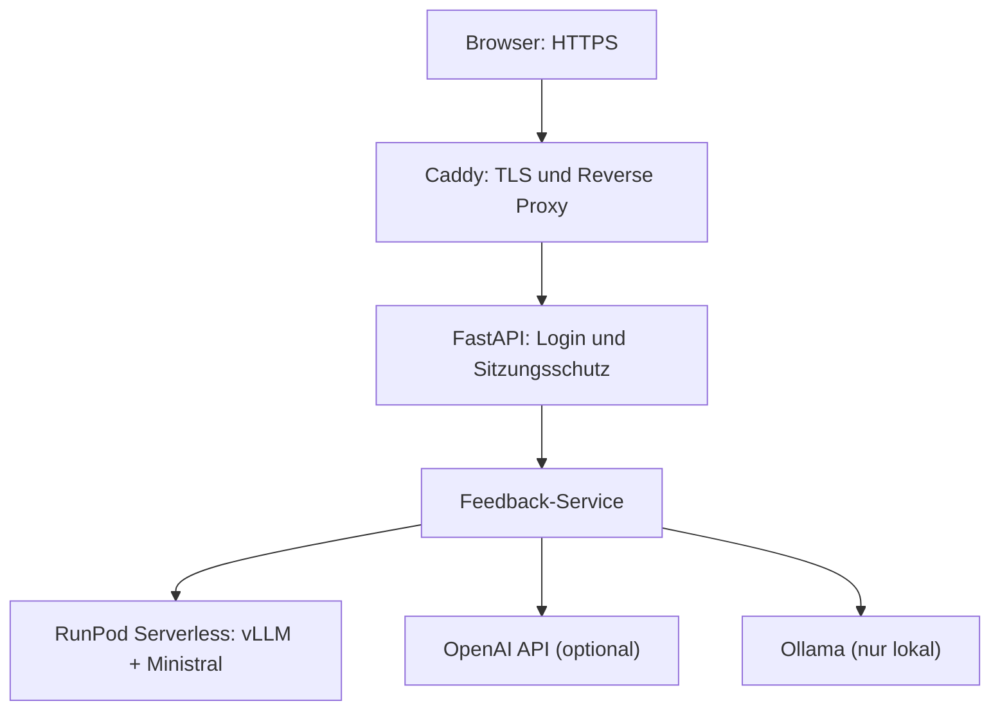

# KI-Schreibfeedback-Prototyp 0.5.0

Web-App-Prototyp zur geschützten Erzeugung von Schreibfeedback mit OpenAI, lokalem Ollama und einem selbst betriebenen Ministral-Modell über RunPod Serverless. Version 0.5.0 stellt die Anwendung produktiv per HTTPS bereit und verwendet für RunPod einen vLLM-Worker.

> **Aktueller Projektstand: Version 0.5.0.** Das geschützte Online-Deployment auf DigitalOcean sowie die serverlose GPU-Inferenz auf RunPod wurden automatisiert und Ende-zu-Ende getestet. Das [Abnahmeprotokoll](docs/abnahme-v0.5.0.md) dokumentiert den geprüften Release-Stand.

## Versionsstand und Ziel

| Version | Status | Inhalt |
|---|---|---|
| **0.3** | abgeschlossen | Provider-Auswahl für Ollama, OpenAI und RunPod, RunPod-Worker, Konfiguration und automatisierte Tests |
| **0.4** | abgeschlossen | Serverseitige Anmeldung, geschützte Web- und Modellrouten, sichere Sitzungen, Login-Begrenzung und CSRF-Schutz |
| **0.5.0** | aktuell | Produktives HTTPS-Deployment auf DigitalOcean, Docker Compose mit Caddy sowie RunPod Serverless mit vLLM |

Version 0.5.0 ist der erste produktiv bereitgestellte und Ende-zu-Ende abgenommene Stand. Weitere Funktionen und Designänderungen werden in nachfolgenden Versionen ergänzt.

## Architektur



Startseite und Analysefunktion sind nur nach erfolgreicher Anmeldung erreichbar. Zugangsdaten werden serverseitig gegen einen Argon2-Passworthash geprüft. RunPod-API-Key, Endpoint-ID und weitere Secrets werden ausschließlich serverseitig aus der `.env` gelesen und nicht an den Browser übertragen.

Im Produktionsmodus ist der lokale Ollama-Provider deaktiviert. Für OpenAI kann ein serverseitiger Standard-Key hinterlegt werden. Browserseitige Provider- und Key-Overrides sind ausschließlich im lokalen Entwicklungsmodus erlaubt. RunPod ist im produktiven Abnahmeszenario vorausgewählt.

## Funktionsumfang von Version 0.5.0

- serverseitige Anmeldung mit einem konfigurierbaren Prüferkonto
- Argon2-Passworthash statt Klartextpasswort in der Konfiguration
- signierte Sitzungscookies mit begrenzter Gültigkeit, `HttpOnly` und `SameSite=Lax`
- Zugriffsschutz für Startseite und Analysefunktion
- Begrenzung wiederholter fehlgeschlagener Loginversuche pro erkanntem Client
- CSRF-Schutz für Login, Logout und Analyseformular
- Eingabe eines anonymisierten, abgetippten Beispieltexts
- Auswahl zwischen lokalem Ollama, OpenAI und RunPod Serverless im Entwicklungsmodus
- Deaktivierung lokaler Ollama-Aufrufe im Produktionsmodus
- konfigurierbare Standardmodelle für alle drei Provider
- dynamisches Laden der lokal installierten Ollama-Modelle
- optionale Modell-ID für künftige oder nicht aufgelistete Ollama- und OpenAI-Modelle
- optional änderbare Ollama-API-Adresse für die lokale Entwicklung
- optionaler OpenAI-Key für einen einzelnen lokalen Testaufruf
- asynchrone RunPod-Aufträge mit Statusabfrage, Zeitlimit und Abbruch bei Zeitüberschreitung
- RunPod-Serverless-Worker mit vLLM und `mistralai/Ministral-3-14B-Instruct-2512`
- Validierung von Modell, Eingabe, Ausgabeformat und erlaubten Generierungsoptionen im Worker
- Anzeige von Provider, tatsächlich verwendetem Modell und Gesamtdauer
- Docker-Image für die FastAPI-Webanwendung und reproduzierbare Docker-Compose-Konfiguration
- Caddy-Reverse-Proxy mit automatischem HTTPS und permanenter `www`-Weiterleitung
- Container-Healthcheck, automatische Neustarts und begrenzte Logdateigrößen
- verständliche Fehlermeldungen bei fehlender Konfiguration oder nicht erreichbaren Providern
- Registry-, Modellkatalog-, Metrik- und SQLite-Architektur als Grundlage für weitere Ausbaustufen

## Projektstruktur

| Pfad | Aufgabe |
|---|---|
| `app/` | FastAPI-Web-App, Provider-Adapter, Services, Templates und statische Dateien |
| `config/models.yaml` | Deklarativer Provider- und Modellkatalog |
| `runpod_worker/` | Docker-Image, Serverless-Handler, Worker und Testeingabe für RunPod |
| `tests/` | Automatisierte Tests für Browserauswahl, RunPod, Anmeldung, Sitzungen, Login-Begrenzung und CSRF-Schutz |
| `scripts/` | Zusätzliche Architektur- und Verbindungsprüfungen |
| `Dockerfile`, `compose.yaml`, `Caddyfile` | Reproduzierbares Produktionsdeployment mit Web-App und HTTPS-Reverse-Proxy |
| `docs/` | Abnahmeprotokolle und bekannte, nicht blockierende Einschränkungen |

## Installation unter Windows

```powershell
cd C:\Users\music\Documents\VisualStudioCodeProjects\ki-schreibfeedback-prototyp

python -m venv .venv
.\.venv\Scripts\Activate.ps1

& ".\.venv\Scripts\python.exe" -m pip install --upgrade pip
& ".\.venv\Scripts\python.exe" -m pip install -r requirements.txt

Copy-Item .env.example .env
```

Für die Anmeldung werden ein Argon2-Passworthash und ein zufälliges Sitzungs-Secret benötigt. Beide Werte lassen sich lokal erzeugen:

```powershell
& ".\.venv\Scripts\python.exe" -c "from getpass import getpass; from pwdlib import PasswordHash; print(PasswordHash.recommended().hash(getpass('Passwort: ')))"
& ".\.venv\Scripts\python.exe" -c "import secrets; print(secrets.token_urlsafe(48))"
```

Die beiden Ausgaben werden in die lokale `.env` übernommen. Das Klartextpasswort selbst wird nicht gespeichert:

```env
APP_MODE=local
AUTH_USERNAME=pruefer
AUTH_PASSWORD_HASH=<erzeugter Argon2-Hash>
SESSION_SECRET=<erzeugtes Sitzungs-Secret>
SESSION_MAX_AGE_SECONDS=3600
LOGIN_RATE_LIMIT_ATTEMPTS=5
LOGIN_RATE_LIMIT_WINDOW_SECONDS=300

OPENAI_API_KEY=
RUNPOD_API_KEY=
RUNPOD_ENDPOINT_ID=
```

`AUTH_PASSWORD_HASH` darf niemals das Klartextpasswort enthalten. Echte Zugangsdaten und Secrets gehören ausschließlich in die lokale `.env`. Diese wird durch `.gitignore` ausgeschlossen und darf nicht in das Git-Repository eingecheckt werden.

`APP_MODE=local` ist für die lokale HTTP-Entwicklung vorgesehen. In `lan_https` und `production` wird das Sitzungscookie nur über HTTPS gesendet; `production` deaktiviert zusätzlich die interaktive API-Dokumentation. Außerhalb des lokalen Modus muss `SESSION_SECRET` gesetzt sein.

## Anwendung starten

```powershell
& ".\.venv\Scripts\python.exe" -m uvicorn app.main:app --reload
```

Danach kann die Anwendung im Browser geöffnet werden:

<http://127.0.0.1:8000>

## Provider verwenden

### Ollama

1. Ollama lokal starten.
2. „Lokal: Ollama“ auswählen.
3. Optional die API-Adresse ändern.
4. „Verbindung prüfen / Modelle laden“ anklicken.
5. Ein installiertes Modell auswählen oder „Andere Modell-ID …“ verwenden.

Die Standardadresse lautet `http://localhost:11434`. Die frei änderbare Adresse ist ausschließlich für die lokale Entwicklung vorgesehen.

### OpenAI

Das in der `.env` konfigurierte Modell ist vorausgewählt. Bekannte Modelle können direkt gewählt werden. Über „Andere Modell-ID …“ lässt sich eine zukünftige Modell-ID eintragen.

Standardmäßig wird der serverseitig konfigurierte OpenAI-Key verwendet. Für lokale Entwicklungstests kann alternativ ein Key für einen einzelnen Aufruf eingegeben werden. Dieser alternative Key wird nicht gespeichert und nach dem Absenden nicht erneut angezeigt.

### RunPod Serverless

Für RunPod werden ein vLLM-kompatibler Serverless-Endpoint sowie `RUNPOD_API_KEY`, `RUNPOD_ENDPOINT_ID` und `RUNPOD_DEFAULT_MODEL` in der `.env` benötigt.

Das produktiv geprüfte Modell lautet `mistralai/Ministral-3-14B-Instruct-2512`. Die Datei `runpod_worker/test_input.json` dient als direkte Testeingabe für den Worker.

Container-Build, Endpoint, Queue-Verarbeitung, Scale-to-zero-Kaltstart und Rückgabe des Schreibfeedbacks an die Webanwendung wurden für Version 0.5.0 produktiv geprüft.

## Tests

Die automatisierten Tests führen keine echten Modellanfragen aus:

```powershell
& ".\.venv\Scripts\python.exe" -m unittest discover -s tests -v
& ".\.venv\Scripts\python.exe" scripts\check_architecture.py
& ".\.venv\Scripts\python.exe" -m json.tool runpod_worker\test_input.json > $null
```

Der geprüfte Stand von Version 0.5.0 umfasst 38 erfolgreiche Tests und 3 erfolgreiche Subtests. Sie decken Browser- und Providerauswahl, Produktionsbeschränkungen, RunPod-Client und -Worker sowie Anmeldung, Sitzungen, Zugriffsschutz, Login-Begrenzung und CSRF-Prüfung ab. Architektur- und JSON-Prüfung sind ebenfalls erfolgreich. Die Tests führen keine echten Modellanfragen aus.

## Abnahme und bekannte Einschränkungen

- [Abnahmeprotokoll für Version 0.5.0](docs/abnahme-v0.5.0.md)
- [Bekannte Einschränkungen](docs/known-issues.md)

Die Modellantwort wird derzeit sicher als reiner Text dargestellt. Enthält sie Markdown-Syntax wie `###`, `**` oder `---`, bleiben diese Zeichen sichtbar. Diese Darstellungsabweichung ist für Version 0.5.0 als nicht blockierende UI-Verbesserung vorgemerkt.

## Sicherheit und Datenschutz

- Die Anmeldung verwendet ein einzelnes, serverseitig konfiguriertes Prüferkonto. In der `.env` wird nur der Argon2-Hash des Passworts gespeichert.
- Das signierte Sitzungscookie ist `HttpOnly`, verwendet `SameSite=Lax` und läuft standardmäßig nach 3.600 Sekunden ab. In den HTTPS-Modi wird zusätzlich das `Secure`-Attribut gesetzt.
- Login, Logout und Analyseformular verwenden sitzungsgebundene CSRF-Tokens. Fehlende oder manipulierte Tokens werden mit HTTP 403 abgewiesen.
- Standardmäßig sind nach fünf fehlgeschlagenen Anmeldungen pro erkanntem Client für fünf Minuten keine weiteren Versuche möglich. Der Zähler liegt im Arbeitsspeicher und wird bei einem Serverneustart zurückgesetzt; verteilte Angriffe werden dadurch allein nicht vollständig verhindert.
- Für Tests dürfen ausschließlich erfundene oder vollständig anonymisierte Texte verwendet werden.
- Der RunPod-Key, die Endpoint-ID und der standardmäßig verwendete OpenAI-Key gehören ausschließlich in die lokale beziehungsweise serverseitige `.env`.
- Die frei änderbare Ollama-Adresse und das optionale OpenAI-Key-Feld sind nur für die lokale Entwicklung vorgesehen.
- Das Produktionsdeployment veröffentlicht ausschließlich Caddy auf Port 80/443; der Webcontainer ist nur an `127.0.0.1:8000` gebunden.
- Die Modellantwort wird escaped als Text ausgegeben. Eine spätere Markdown-Darstellung muss weiterhin verhindern, dass Modellinhalt ungeprüft als HTML ausgeführt wird.
