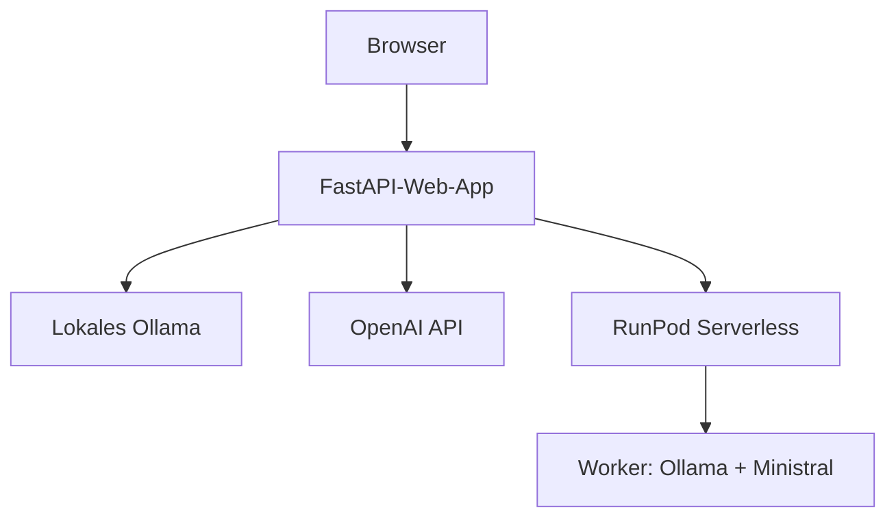

# KI-Schreibfeedback-Prototyp 0.3

Web-App-Prototyp zur vergleichenden Erzeugung von Schreibfeedback mit einem lokal betriebenen Ollama-Modell, der OpenAI API und einem selbst betriebenen Ministral-Modell über RunPod Serverless.

> **Aktueller Projektstand: Version 0.3.** Die RunPod-Integration ist implementiert und automatisiert getestet. Ein geschütztes Online-Deployment ist noch nicht Bestandteil dieser Version.

## Versionsstand und Ziel

| Version | Status | Inhalt |
|---|---|---|
| **0.3** | aktuell | Provider-Auswahl für Ollama, OpenAI und RunPod, RunPod-Worker, Konfiguration und automatisierte Tests |
| **0.4** | nächstes Zwischenziel | Serverseitige Anmeldung und vollständiger Zugriffsschutz für Web-App und Modellaufrufe |
| **0.5** | Online-Ziel | Geschützte und getestete Bereitstellung der Web-App auf DigitalOcean und des Modells auf RunPod |

Version 0.3 ist damit ein funktionsfähiger Entwicklungsstand, aber noch nicht für eine frei erreichbare Bereitstellung vorgesehen. Weitere Funktionen und Designänderungen können nach Version 0.5 in nachfolgenden Versionen ergänzt werden.

## Architektur



Der RunPod-API-Key und die RunPod-Endpoint-ID werden ausschließlich serverseitig aus der `.env` gelesen und nicht an den Browser übertragen.

Für OpenAI kann ebenfalls ein serverseitiger Standard-Key in der `.env` hinterlegt werden. Version 0.3 erlaubt für lokale Entwicklungstests zusätzlich die einmalige Eingabe eines alternativen OpenAI-Keys im Browser. Dieser wird nicht gespeichert oder erneut angezeigt, aber an das FastAPI-Backend übertragen. Diese lokale Testfunktion ist nicht für ein öffentliches Deployment vorgesehen und wird vor dem Onlinegang entfernt oder geschützt.

## Funktionsumfang von Version 0.3

- Eingabe eines anonymisierten, abgetippten Beispieltexts
- Auswahl zwischen lokalem Ollama, OpenAI und RunPod Serverless
- konfigurierbare Standardmodelle für alle drei Provider
- dynamisches Laden der lokal installierten Ollama-Modelle
- optionale Modell-ID für künftige oder nicht aufgelistete Ollama- und OpenAI-Modelle
- optional änderbare Ollama-API-Adresse für die lokale Entwicklung
- optionaler OpenAI-Key für einen einzelnen lokalen Testaufruf
- asynchrone RunPod-Aufträge mit Statusabfrage, Zeitlimit und Abbruch bei Zeitüberschreitung
- eigener RunPod-Worker mit Ollama und eingebettetem Ministral-Modell
- Validierung von Modell, Eingabe, Ausgabeformat und erlaubten Generierungsoptionen im Worker
- Anzeige von Provider, tatsächlich verwendetem Modell und Gesamtdauer
- verständliche Fehlermeldungen bei fehlender Konfiguration oder nicht erreichbaren Providern
- Registry-, Modellkatalog-, Metrik- und SQLite-Architektur als Grundlage für weitere Ausbaustufen

## Projektstruktur

| Pfad | Aufgabe |
|---|---|
| `app/` | FastAPI-Web-App, Provider-Adapter, Services, Templates und statische Dateien |
| `config/models.yaml` | Deklarativer Provider- und Modellkatalog |
| `runpod_worker/` | Docker-Image, Serverless-Handler, Worker und Testeingabe für RunPod |
| `tests/` | Automatisierte Tests für Browserauswahl, RunPod-Client und Worker |
| `scripts/` | Zusätzliche Architektur- und Verbindungsprüfungen |

## Installation unter Windows

```powershell
cd C:\Users\music\Documents\VisualStudioCodeProjects\ki-schreibfeedback-prototyp

python -m venv .venv
.\.venv\Scripts\Activate.ps1

python -m pip install --upgrade pip
pip install -r requirements.txt

Copy-Item .env.example .env
```

Echte Zugangsdaten dürfen ausschließlich in die lokale `.env` eingetragen werden. Je nach verwendetem Provider werden folgende Werte benötigt:

```env
OPENAI_API_KEY=
RUNPOD_API_KEY=
RUNPOD_ENDPOINT_ID=
```

Die `.env` wird durch `.gitignore` ausgeschlossen und darf nicht in das Git-Repository eingecheckt werden.

## Anwendung starten

```powershell
.\.venv\Scripts\Activate.ps1
python -m uvicorn app.main:app --reload
```

Danach kann die Anwendung im Browser geöffnet werden:

<http://127.0.0.1:8000>

## Provider verwenden

### Ollama

1. Ollama lokal starten.
2. „Lokal: Ollama“ auswählen.
3. Optional die API-Adresse ändern.
4. „Verbindung prüfen / Modelle laden“ anklicken.
5. Ein installiertes Modell auswählen oder „Andere Modell-ID …“ verwenden.

Die Standardadresse lautet `http://localhost:11434`. Die frei änderbare Adresse ist ausschließlich für die lokale Entwicklung vorgesehen.

### OpenAI

Das in der `.env` konfigurierte Modell ist vorausgewählt. Bekannte Modelle können direkt gewählt werden. Über „Andere Modell-ID …“ lässt sich eine zukünftige Modell-ID eintragen.

Standardmäßig wird der serverseitig konfigurierte OpenAI-Key verwendet. Für lokale Entwicklungstests kann alternativ ein Key für einen einzelnen Aufruf eingegeben werden. Dieser alternative Key wird nicht gespeichert und nach dem Absenden nicht erneut angezeigt.

### RunPod Serverless

Für RunPod werden ein aus `runpod_worker/Dockerfile` gebauter Serverless-Endpoint sowie `RUNPOD_API_KEY` und `RUNPOD_ENDPOINT_ID` in der lokalen `.env` benötigt.

Das Modell ist für diesen Provider fest konfiguriert. Die Datei `runpod_worker/test_input.json` dient als direkte Testeingabe für den Worker.

Der Docker- und Worker-Code ist Bestandteil von Version 0.3. Der reale Container-Build, die Einrichtung des Endpoints und der vollständige End-to-End-Test folgen vor dem Online-Stand 0.5.

## Tests

Die automatisierten Tests führen keine echten Modellanfragen aus:

```powershell
python -m unittest discover -s tests -v
python scripts\check_architecture.py
python -m json.tool runpod_worker\test_input.json > $null
```

Der geprüfte Stand von Version 0.3 umfasst 15 erfolgreiche automatisierte Tests.

## Sicherheit und Datenschutz

- Version 0.3 besitzt noch keinen Login und darf deshalb nicht ungeschützt öffentlich bereitgestellt werden.
- Für Tests dürfen ausschließlich erfundene oder vollständig anonymisierte Texte verwendet werden.
- Der RunPod-Key, die Endpoint-ID und der standardmäßig verwendete OpenAI-Key gehören ausschließlich in die lokale beziehungsweise serverseitige `.env`.
- Die frei änderbare Ollama-Adresse und das optionale OpenAI-Key-Feld sind nur für die lokale Entwicklung vorgesehen.
- Der vollständige Login- und Zugriffsschutz ist das Ziel von Version 0.4.
- HTTPS, Firewall, Produktionskonfiguration und die geschützte Online-Bereitstellung werden für Version 0.5 abgeschlossen.