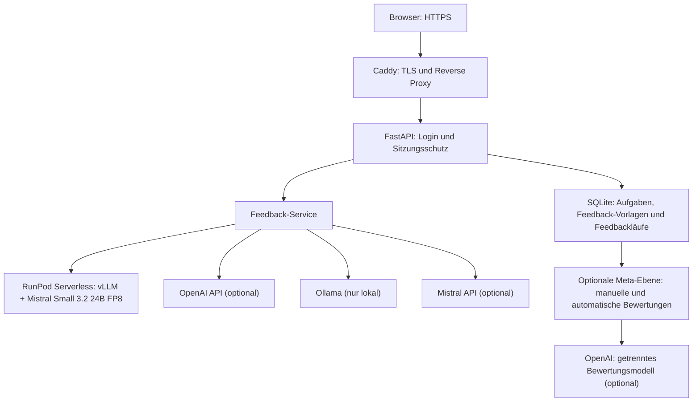

# KI-Schreibfeedback-Prototyp 1.0.0-rc1

Web-App-Prototyp zur geschützten Erzeugung von Schreibfeedback mit OpenAI, der Mistral-Cloud-API, lokalem Ollama und einem selbst betriebenen Mistral-Small-3.2-24B-Modell über RunPod Serverless. Version 1.0.0-rc1 verwendet eine frei festlegbare Standard-Kriterienvorlage und die kriterienweise Einzelanalyse als übersichtlichen Normalbetrieb. Gemeinsame Analyse, Zwei-Pass-Prüfung, kriterienloses Gesamtfeedback, freie Modell-IDs und technische Verbindungsoptionen bleiben über „Erweiterte Forschungsoptionen anzeigen“ für gezielte Vergleiche erhalten.

> **Aktueller stabiler Release: Version 0.6.0.** Der unveränderliche Git-Tag `v0.6.0` ist der verbindliche Rückkehrpunkt für das Produktionssystem und die Ausgangsbasis für Version 0.7. Das [Abnahmeprotokoll 0.6.0](docs/abnahme-v0.6.0.md) dokumentiert den geprüften Stand.

## Versionsstand und Ziel

| Version | Status | Inhalt |
|---|---|---|
| **0.3** | abgeschlossen | Provider-Auswahl für Ollama, OpenAI und RunPod, RunPod-Worker, Konfiguration und automatisierte Tests |
| **0.4** | abgeschlossen | Serverseitige Anmeldung, geschützte Web- und Modellrouten, sichere Sitzungen, Login-Begrenzung und CSRF-Schutz |
| **0.5.0** | abgeschlossen | Produktives HTTPS-Deployment auf DigitalOcean, Docker Compose mit Caddy sowie RunPod Serverless mit vLLM |
| **0.6.0** | stabiler Release | Vier serverseitig erlaubte GPU-Ziele, sichere Markdown-Ausgabe, Worker-/Jobstatus, Live-Warteanzeige, getrennte Zeiten und gezielter Einzelabbruch |
| **0.7** | abgeschlossen | Additive Mistral-API-Anbindung mit Ministral 14B, Small, Medium, Large und freier Modell-ID auf Basis des unveränderten Tags `v0.6.0` |
| **0.8** | abgeschlossen | Aufgaben mit jeweils einer Feedback-Vorlage, geordnete Einzelkriterien, SQLite-Verwaltung, portabler Austausch und strukturiertes Feedback pro Kriterium |
| **0.9a** | abgeschlossen | Bewusste Auswahl von Feedbackläufen, Speicherung des anonymisierten Texts und getrennte Übersicht auf der Meta-Ebene |
| **0.9b** | abgeschlossen | Manuelle Qualitätsbewertung mit vier Kriterien, Begründungen, versioniertem Bogen und eigenständiger Bewertungshistorie |
| **0.9c** | abgeschlossen | Optionale automatische Cloud-Vorbewertung mit festem Referenzmodell, detaillierter Evidenzprüfung und anschließender manueller Korrektur als eigener Datensatz |
| **0.10** | experimenteller Testzweig | Vergleich von gemeinsamer, kriterienweiser und Zwei-Pass-Analyse mit getrennter Quellenrolle und technischer Belegprüfung |
| **1.0.0-rc1** | Release Candidate | Konfigurierbare Standard-Kriterienvorlage, kriterienweise Analyse als Normalmodus und aufgeräumte Oberfläche mit optionalen Forschungsfunktionen |

Version 0.5.0 bleibt als historischer erster Produktionsrelease erhalten. Version 0.6.0 ist der neue stabile Standard; Modell-Payload und vLLM-Startkonfiguration bleiben gegenüber 0.5.0 unverändert.

## Architektur



Startseite und Analysefunktion sind nur nach erfolgreicher Anmeldung erreichbar. Zugangsdaten werden serverseitig gegen einen Argon2-Passworthash geprüft. RunPod-API-Key, Endpoint-ID und weitere Secrets werden ausschließlich serverseitig aus der `.env` gelesen und nicht an den Browser übertragen.

Im Produktionsmodus ist der lokale Ollama-Provider deaktiviert. Für OpenAI und Mistral können serverseitige Standard-Keys hinterlegt werden. Browserseitige Provider- und Key-Overrides sind ausschließlich im lokalen Entwicklungsmodus erlaubt. OpenAI ist in der Textanalyse vorausgewählt; Mistral, RunPod und im lokalen Modus Ollama bleiben direkt auswählbar.

## Aktueller Funktionsumfang

- serverseitige Anmeldung mit einem konfigurierbaren Prüferkonto
- Argon2-Passworthash statt Klartextpasswort in der Konfiguration
- signierte Sitzungscookies mit begrenzter Gültigkeit, `HttpOnly` und `SameSite=Lax`
- Zugriffsschutz für Startseite und Analysefunktion
- Begrenzung wiederholter fehlgeschlagener Loginversuche pro erkanntem Client
- CSRF-Schutz für Login, Logout und Analyseformular
- Eingabe eines anonymisierten, abgetippten Beispieltexts
- Erstellen, Bearbeiten, Duplizieren und Löschen von Aufgaben mit jeweils einer Feedback-Vorlage
- bis zu 100 geordnete Feedback-Kriterien pro Vorlage
- frei festlegbare Standard-Kriterienvorlage mit automatischer Vorauswahl im Analyseformular
- optionaler Originaltext je Analyselauf, unabhängig vom dauerhaft in der Aufgabe gespeicherten Material
- kriterienweise Standardanalyse mit genau einem sequenziellen, fokussierten Modellaufruf je Kriterium
- gemeinsame Kriterienanalyse mit genau einer Modellanfrage als erweiterte Vergleichsoption
- gezielte manuelle Aktualisierung einer einzelnen Ergebniskarte mit genau einem zusätzlichen Kriterienaufruf
- optionaler Zwei-Pass-Versuch mit zwei aufeinanderfolgenden Anfragen an dasselbe ausgewählte Modell in den Forschungsoptionen
- wörtliche Schülertextbelege mit serverseitiger Herkunftsprüfung vor der Übernahme eines Kriterienfeedbacks
- intern getrenntes Feedback und konkreter Überarbeitungsschritt zu jedem Kriterium, sichtbar als zwei Absätze in einem gemeinsamen Feedbackfeld
- vier validierte Erfüllungsstufen: erfüllt, überwiegend erfüllt, teilweise erfüllt und nicht erfüllt; zusätzlich der Sonderstatus nicht beurteilbar
- schülerverständlich formuliertes Gesamtfeedback über die Auswahl „Ohne Feedback-Vorlage“
- speicher- und meta-bewertbare Standardfeedbacks mit dokumentierter Prompt-Version und klarer Kennzeichnung des reduzierten Erzeugungskontexts
- echtes Löschen unbenutzter und sicheres Archivieren bereits verwendeter Feedback-Vorlagen
- JSON-Einzelexport und rundreisefestes ZIP-Gesamtpaket mit versioniertem Austauschformat
- persistente Snapshots der verwendeten Feedback-Vorlage und des erzeugten Kriterienfeedbacks
- ausdrücklich auswählbare Feedbackläufe für eine spätere Meta-Bewertung
- getrennte dritte Registerkarte „Feedback-Bewertung“ mit Modell, Aufgabe und Feedbackdauer
- vollständiges Entfernen eines Feedbackbogens aus der Bewertungsansicht einschließlich seiner Meta-Bewertungen und des gespeicherten Schülertexts
- aufklappbare Detailansicht mit Zusammenfassung und allen Einzelfeedbacks
- Speicherung des anonymisierten Schülertexts erst nach dem bewussten Auswahlklick
- getrennt aufklappbare Bewertungsgrundlage mit Aufgabe, Material, Schülertext und Feedback-Kriterien
- versionierter manueller Meta-Bewertungsbogen mit vier Qualitätskriterien
- vier Bewertungsstufen von 0 bis 3 und verpflichtende Begründung je Qualitätskriterium
- getrennte Mehrfachbewertungen ohne gespeicherte Gesamtnote; ein farbcodierter arithmetischer Mittelwert von 0 bis 3 dient als kompakte Orientierung
- zweistufig aufklappbare Bewertungshistorie mit Kurzansicht für jede einzelne Meta-Bewertung
- lokaler PDF-Einzelexport jeder Meta-Bewertung mit Kriterienwerten, Begründungen und Laufmetadaten
- jede Bewertung kann optional benannt und nach ausdrücklicher Bestätigung einzeln gelöscht werden
- persistente Snapshots von Version, Prüffragen und Skalenbezeichnungen jeder Bewertung
- ausdrücklich ausgelöste automatische Cloud-Vorbewertung über die OpenAI Responses API
- festes starkes Referenzmodell `gpt-5.6-sol` mit `pro`-Modus und hohem Reasoning-Aufwand
- detaillierte, gegen Aufgabe, Aufgabenmaterial, laufbezogenen Originaltext, Kriterien und Schülertext abgeglichene Evidenzprüfung
- striktes strukturiertes Ausgabeformat mit genau einer Bewertung und Begründung pro Qualitätskriterium
- unveränderliche Speicherung der KI-Vorbewertung einschließlich Modell, Prompt-Version, Dauer und Request-ID
- vorausgefülltes manuelles Formular zum Prüfen und Anpassen der KI-Werte ohne Überschreiben des Originals; die manuelle Prüfung bleibt mit ihrer KI-Ausgangsbewertung verknüpft
- vordefinierte OpenAI-Auswahl von GPT-5.6 Luna über Terra bis Sol sowie getrennte Denktiefen von `none` bis `max`
- Auswahl zwischen lokalem Ollama, OpenAI, Mistral und RunPod Serverless im Entwicklungsmodus
- Deaktivierung lokaler Ollama-Aufrufe im Produktionsmodus
- konfigurierbare Standardmodelle für alle vier Provider
- dynamisches Laden der lokal installierten Ollama-Modelle
- optionale Modell-ID für künftige oder nicht aufgelistete Ollama-, OpenAI- und Mistral-Modelle
- optional änderbare Ollama-API-Adresse für die lokale Entwicklung
- optionale OpenAI- und Mistral-Keys für jeweils einen einzelnen lokalen Testaufruf
- asynchrone RunPod-Aufträge mit Statusabfrage, Zeitlimit und Abbruch bei Zeitüberschreitung
- RunPod-Serverless-Worker mit vLLM und `RedHatAI/Mistral-Small-3.2-24B-Instruct-2506-FP8`
- Validierung von Modell, Eingabe, Ausgabeformat und erlaubten Generierungsoptionen im Worker
- Anzeige von Provider, tatsächlich verwendetem Modell und Gesamtdauer
- Auswahl zwischen Standard-Pool, RTX 4090, RTX 5090 und RTX 6000 Ada über serverseitig erlaubte Endpoint-IDs
- kompakte RunPod-Betriebsbereitschaft mit Worker-Kapazität, Zeitpunkt und aggregierten Workerzahlen
- verständlicher Live-Status mit laufendem Zeitmesser während Queue, Cold Start und Modellverarbeitung
- individueller Jobstatus mit Orange für `IN_QUEUE` und Grün erst ab `IN_PROGRESS` beziehungsweise `RUNNING`
- persistente technische Registrierung aktiver RunPod-Jobs ohne Schülertext oder Prompt
- eingeklappte Verwaltung zum gezielten Abbruch registrierter und manuell angegebener Altjobs
- getrennte Anzeige von Gesamtzeit, RunPod-`delayTime` und RunPod-`executionTime`
- intern beibehaltene, aber in der bereinigten GUI ausgeblendete Supply-, Warmhalte- und Workerdetaildaten
- Docker-Image für die FastAPI-Webanwendung und reproduzierbare Docker-Compose-Konfiguration
- Caddy-Reverse-Proxy mit automatischem HTTPS und permanenter `www`-Weiterleitung
- Container-Healthcheck, automatische Neustarts und begrenzte Logdateigrößen
- verständliche Fehlermeldungen bei fehlender Konfiguration oder nicht erreichbaren Providern
- Registry-, Modellkatalog-, Metrik- und SQLite-Architektur als Grundlage für weitere Ausbaustufen

## Projektstruktur

| Pfad | Aufgabe |
|---|---|
| `app/` | FastAPI-Web-App, Provider-Adapter, Services, Templates und statische Dateien |
| `config/models.yaml` | Deklarativer Provider- und Modellkatalog |
| `runpod_worker/` | Docker-Image, Serverless-Handler, Worker und Testeingabe für RunPod |
| `tests/` | Automatisierte Tests für Browserauswahl, Aufgaben, Feedback-Vorlagen, SQLite, RunPod, Anmeldung, Sitzungen, Login-Begrenzung und CSRF-Schutz |
| `scripts/` | Zusätzliche Architektur- und Verbindungsprüfungen |
| `Dockerfile`, `compose.yaml`, `Caddyfile` | Reproduzierbares Produktionsdeployment mit Web-App und HTTPS-Reverse-Proxy |
| `docs/` | Abnahmeprotokolle und bekannte, nicht blockierende Einschränkungen |

## Installation unter Windows

```powershell
cd C:\Users\music\Documents\VisualStudioCodeProjects\ki-schreibfeedback-prototyp

python -m venv .venv
.\.venv\Scripts\Activate.ps1

& ".\.venv\Scripts\python.exe" -m pip install --upgrade pip
& ".\.venv\Scripts\python.exe" -m pip install -r requirements.txt

Copy-Item .env.example .env
```

Für die Anmeldung werden ein Argon2-Passworthash und ein zufälliges Sitzungs-Secret benötigt. Beide Werte lassen sich lokal erzeugen:

```powershell
& ".\.venv\Scripts\python.exe" -c "from getpass import getpass; from pwdlib import PasswordHash; print(PasswordHash.recommended().hash(getpass('Passwort: ')))"
& ".\.venv\Scripts\python.exe" -c "import secrets; print(secrets.token_urlsafe(48))"
```

Die beiden Ausgaben werden in die lokale `.env` übernommen. Das Klartextpasswort selbst wird nicht gespeichert:

```env
APP_MODE=local
AUTH_USERNAME=pruefer
AUTH_PASSWORD_HASH=<erzeugter Argon2-Hash>
SESSION_SECRET=<erzeugtes Sitzungs-Secret>
SESSION_MAX_AGE_SECONDS=3600
LOGIN_RATE_LIMIT_ATTEMPTS=5
LOGIN_RATE_LIMIT_WINDOW_SECONDS=300

OLLAMA_BASE_URL=http://localhost:11434
OLLAMA_DEFAULT_MODEL=mistral-small3.2:24b-instruct-2506-q8_0

OPENAI_API_KEY=
OPENAI_EVALUATION_MODEL=gpt-5.6-sol
MISTRAL_API_KEY=
RUNPOD_API_KEY=
RUNPOD_ENDPOINT_ID=
```

`AUTH_PASSWORD_HASH` darf niemals das Klartextpasswort enthalten. Echte Zugangsdaten und Secrets gehören ausschließlich in die lokale `.env`. Diese wird durch `.gitignore` ausgeschlossen und darf nicht in das Git-Repository eingecheckt werden.

`APP_MODE=local` ist für die lokale HTTP-Entwicklung vorgesehen. In `lan_https` und `production` wird das Sitzungscookie nur über HTTPS gesendet; `production` deaktiviert zusätzlich die interaktive API-Dokumentation. Außerhalb des lokalen Modus muss `SESSION_SECRET` gesetzt sein.

## Anwendung starten

```powershell
& ".\.venv\Scripts\python.exe" -m uvicorn app.main:app --reload
```

Danach kann die Anwendung im Browser geöffnet werden:

<http://127.0.0.1:8000>

## Aufgaben und Feedback verwenden

Unter „Feedback“ wird eine Aufgabe gemeinsam mit genau einer Feedback-Vorlage angelegt. Die Vorlage besteht aus mehreren einzeln sortierbaren Feedback-Kriterien. Eine aktive Aufgabe lässt sich dort als Standard-Kriterienvorlage festlegen und wird anschließend in der Textanalyse automatisch vorausgewählt; für einen einzelnen Lauf kann weiterhin eine andere Vorlage gewählt werden. Der Normalmodus analysiert jedes Kriterium nacheinander in einem eigenen fokussierten Modellaufruf. Die gemeinsame Analyse und die Zwei-Pass-Prüfung werden erst über „Erweiterte Forschungsoptionen anzeigen“ eingeblendet. Die bestehenden JSON-Vorlagen bleiben unverändert kompatibel: Die Standardauswahl wird installationsbezogen in SQLite gespeichert und ist bewusst nicht Bestandteil des portablen JSON-Austauschformats.

Die Auswahl „Ohne Feedback-Vorlage – bisheriges Gesamtfeedback“ bleibt als bewusst kontextarmer Vergleichsmodus erhalten, ist aber nur in den erweiterten Forschungsoptionen sichtbar. Das Modell erhält dabei ausschließlich den anonymisierten Schülertext und den versionierten Standardprompt `standard-feedback-v3`, jedoch keine Aufgabe, kein Material, keinen Originaltext, keine Jahrgangsstufe und keine Feedback-Kriterien. Der Prompt verlangt klare, nicht unnötig schwierige Sprache und kurze Erklärungen unvermeidbarer Fachbegriffe. Tabellen und spaltenartige Trennzeichen sind ausdrücklich ausgeschlossen; konkrete Überarbeitungshinweise werden als nummerierte Blöcke mit „Original“, „Mögliche Überarbeitung“ und „Begründung“ angefordert. Nutzer-Promptvorlage, eine gegebenenfalls vom Provider verwendete separate Systemnachricht und der Erzeugungsmodus werden zusammen mit dem Feedback als Snapshot gespeichert; der Schülertext selbst wird dabei weiterhin zunächst nur gehasht.

Für allgemeine JSON-Aufgaben erscheint nach der Auswahl in der Textanalyse zusätzlich das aufklappbare Feld „Originaltext für diesen Lauf“. Dort lässt sich optional das konkrete Gedicht, die Quelle oder ein anderer Ausgangstext einfügen. Dieser Originaltext ist ein eigener Bestandteil des Feedbacklaufs und verändert weder die gespeicherte Aufgabe noch deren Material. Aufgabenmaterial und laufbezogener Originaltext werden getrennt an das Feedbackmodell übermittelt, im technischen Feedbacklauf gespeichert und später auch der automatischen Meta-Bewertung bereitgestellt. So kann dieselbe allgemeine Aufgabe nacheinander mit unterschiedlichen Ausgangstexten verwendet werden.

Ein eigener Bereich für eine ausformulierte Modelllösung oder einen Erwartungshorizont ist in diesem Teststand noch nicht vorhanden. Kurze verbindliche Erwartungspunkte gehören deshalb in das jeweils passende Feedback-Kriterium. Das Feld „Originaltext für diesen Lauf“ bleibt ausschließlich der Primärquelle vorbehalten, beispielsweise dem Gedicht, und darf nicht für eine Modelllösung verwendet werden. Eine vollständige Referenzlösung sollte auch nicht ersatzweise in das Aufgabenmaterial kopiert werden: Gerade schwächere Modelle könnten sie trotz Prompt-Trennung als Schülerleistung oder als zwingend nachzuahmende Formulierung behandeln. Ein künftiges optionales Feld müsste sie daher als eigene Quellenrolle kennzeichnen und ausdrücklich festlegen, dass Abweichungen nicht automatisch Fehler sind.

Für Versuche sind standardmäßig bis zu 100 Einzelkriterien mit jeweils 10.000 Zeichen möglich. Beide Schutzgrenzen lassen sich in der lokalen `.env` über `MAX_CRITERIA` und `MAX_CRITERION_CHARS` anpassen. Sehr umfangreiche Vorlagen können unabhängig davon die Kontextgrenze des ausgewählten Sprachmodells überschreiten.

Die strukturierte Modellantwort wird vollständig validiert: Jede im jeweiligen Aufruf erwartete Kriterien-ID muss genau einmal vorkommen; unbekannte, doppelte oder fehlende Kriterien werden abgelehnt. Der versionierte Kriterienprompt `rubric-feedback-v4-grounded-complete-criteria` trennt Schülertext, Aufgabe, Material, laufbezogenen Originaltext und Kriterien ausdrücklich nach ihrer Quellenrolle. Kriterien gelten auch bei Formulierungen wie „Du hast …“ ausschließlich als Anforderungen und niemals als Beleg für eine Schülerleistung. Ein mehrteiliges Kriterium darf nur dann als vollständig erfüllt gelten, wenn sämtliche Teilanforderungen geprüft wurden; eine einzelne gefundene Stärke genügt nicht. Für jeden fachlich beurteilbaren Status von „Erfüllt“ bis „Nicht erfüllt“ soll das Modell mindestens einen kurzen wörtlichen Ausschnitt aus dem Schülertext liefern. Kann es keinen Beleg sicher kopieren, wird es ausdrücklich zu „Nicht beurteilbar“, einer leeren Belegliste und einem neutralen Kontrollhinweis ohne erfundene Überarbeitungsempfehlung angewiesen. Fehlt trotz des strikten Schemas ein nicht leerer nächster Schritt, übernimmt die Anwendung einen neutralen Hinweis, statt den gesamten Lauf abzubrechen oder selbst einen fachlichen Schritt zu erfinden.

Die Herkunftsprüfung `safe-partial-word-sequence-v3` verlangt für gelieferte Belege eine zusammenhängende identische Wortfolge, toleriert aber Großschreibung, Leerraum, umschließende Anführungszeichen, Auslassungszeichen und reine Zeichensetzungsunterschiede. Paraphrasen, veränderte Wörter und still korrigierte Schülerfehler bleiben ungültig. Liefert ein Modell dennoch einen erfundenen, doppelten, nicht aussagekräftigen oder fehlenden Pflichtbeleg, wird nicht mehr der gesamte Feedbacklauf abgebrochen: Nur der betroffene KI-Befund samt potenziell falschem Überarbeitungshinweis wird verworfen und durch eine sichere Kennzeichnung als „Nicht beurteilbar“ ersetzt. Eine sichtbare Warnung nennt das Kriterium und gegebenenfalls den zurückgewiesenen Ausschnitt; die übrigen belegten Einzelrückmeldungen bleiben erhalten. Sobald mindestens ein Befund ersetzt wurde, wird auch die ungeprüfte Modellzusammenfassung durch einen neutralen Hinweis ersetzt. Dafür erfolgt keine zweite Modell- oder API-Anfrage. Im gespeicherten Lauf dokumentieren ein Prüfkennzeichen je Kriterium sowie reine Zählwerte den Eingriff; die technischen Belegtexte selbst werden weiterhin nicht gespeichert. Das Austauschformat der Vorlagen und der datensparsame Speicherweg bleiben unverändert.

### Kriterienweise Einzelanalyse

Bei der Option „Kriterienweise Analyse“ erhält jedes Kriterium einen eigenen Modellaufruf. Jeder Aufruf enthält weiterhin den vollständigen Schülertext, die Aufgabenstellung, das Aufgabenmaterial und den optionalen laufbezogenen Originaltext, aber aus der Feedback-Vorlage ausschließlich das gerade geprüfte Kriterium. So kann sich auch ein kleineres Modell auf einen Bewertungsmaßstab konzentrieren und vermischt Anforderungen verschiedener Kriterien weniger leicht. Die Einzelaufrufe werden bewusst nacheinander ausgeführt; dadurch konkurrieren sie bei einem lokalen Ollama-Modell nicht gleichzeitig um denselben GPU-Speicher.

Ein Klick auf „Feedback generieren“ startet die vollständige Folge. Eine Vorlage mit fünf Kriterien verursacht somit fünf Modellaufrufe. Ein strukturell nicht auswertbarer Einzelaufruf wird als „Nicht beurteilbar“ gekennzeichnet, während die bereits belegten anderen Einzelrückmeldungen erhalten bleiben. Ergebnisansicht und gespeicherter Feedbacklauf dokumentieren Anzahl, Prompt-Version, Einzellaufzeiten und – soweit vom Provider geliefert – die technischen Request-IDs. Bei OpenAI und Mistral entstehen entsprechend mehr tokenbasierte Kosten; bei Ollama steigt vor allem die Laufzeit, und bei RunPod werden mehrere Serverless-Jobs nacheinander erzeugt. Das Verfahren ist bei allen Providern der vorausgewählte Normalmodus.

Unabhängig vom ursprünglich gewählten Analyseverfahren besitzt anschließend jede Kriterienkarte einen Button „Aktualisieren“. Er löst genau einen zusätzlichen fokussierten Aufruf für dieses Kriterium aus und ersetzt bei Erfolg nur diese Karte. Vollständiger Schülertext, Aufgabe, Material und laufbezogener Originaltext werden erneut übermittelt; Anbieter, Modell und gegebenenfalls Denktiefe müssen gegenüber dem ursprünglichen Lauf unverändert bleiben. Während des Aufrufs zeigt die Karte einen eigenen Fortschrittshinweis, ein Fehler lässt die bisherige Rückmeldung stehen. Die Anwendung neutralisiert nach der ersten Einzelaktualisierung die möglicherweise veraltete Gesamtzusammenfassung und speichert Anzahl, Laufzeit, Prompt-Version, Prüfversion und technische Request-ID der Aktualisierungen im Feedbacklauf. Sobald der Lauf ausdrücklich für die Meta-Bewertung gespeichert wurde, ist er unveränderlich; weitere Aktualisierungen erfordern dann einen neuen Feedbacklauf. Jeder Klick kann bei Cloud-Anbietern zusätzliche Kosten verursachen.

### Experimenteller Zwei-Pass-Modus

Die Option „Zwei-Pass-Prüfung“ ist bei allen Providern standardmäßig ausgeschaltet und bleibt eine bewusst auswählbare Forschungsvariante. Im Experiment verarbeitet dasselbe ausgewählte Provider-Modell alle Kriterien gemeinsam in zwei Phasen; es findet kein verborgener Wechsel auf OpenAI und kein dritter Formulierungsaufruf statt.

Die Befundphase `candidate-findings-v2` darf je Kriterium höchstens eine Stärke und zwei priorisierte Verbesserungsmöglichkeiten vorschlagen. Jeder Kandidat muss einen wörtlichen Schülertextbeleg und einen wörtlichen Beleg aus genau dem aktuellen Kriterium enthalten. Behauptete Widersprüche zum Material oder Originaltext benötigen zusätzlich einen Beleg aus genau dieser Quelle. Ein Verbesserungsbefund ohne konkreten sicheren nächsten Schritt und eine Stärke mit einem unnötigen Überarbeitungsschritt werden technisch verworfen. Der Server prüft diese typisierten Quellenrollen mit `typed-student-source-criterion-word-sequence-v2`, bevor ein Befund die zweite Phase erreicht.

Die eingeschränkte Zweitprüfung `restricted-review-v2` erhält nur die technisch gültigen Kandidaten mit festen IDs und den vollständigen getrennten Kontext. Sie muss jeden Kandidaten genau einmal bestätigen oder verwerfen und darf keine neue Stärke, keinen neuen Fehler und keinen neuen Überarbeitungsvorschlag ergänzen. Auch hier darf ein mehrteiliges Kriterium nicht allein wegen einer bestätigten Stärke als vollständig erfüllt gelten. Das sichtbare Feedback wird anschließend deterministisch ausschließlich aus bestätigten Kandidaten zusammengesetzt. Ist die Zweitprüfung strukturell ungültig oder bleibt kein sicherer Befund übrig, wird bewusst neutrales „Nicht beurteilbar“ statt ungeprüften Inhalts ausgegeben. Gibt es ausschließlich bestätigte Stärken, entfällt der zweite Absatz mit dem Überarbeitungsschritt.

Die Ergebnisansicht zeigt Dauer, Kandidatenzahl sowie technisch gültige, übernommene und verworfene Befunde. Modus, beide Prompt-Versionen, Phasenlaufzeiten und reine Zählwerte werden im Feedbacklauf gespeichert, damit gemeinsame, kriterienweise und Zwei-Pass-Ergebnisse anschließend auf der Meta-Ebene verglichen werden können. Die technischen Belegtexte selbst werden dort nicht zusätzlich gespeichert. Zwei Modellaufrufe verursachen ungefähr die doppelte Laufzeit und je nach Provider zusätzliche Kosten. Der Modus unterstützt Ollama, OpenAI, Mistral und RunPod. Bei RunPod werden zwei Jobs nacheinander gestartet; die technische Browser-Tracking-ID wechselt erst nach dem terminalen Status des ersten Jobs sicher auf den zweiten.

Für jedes Kriterium stehen weiterhin die vier echten Erfüllungsstufen „Erfüllt“, „Überwiegend erfüllt“, „Teilweise erfüllt“ und „Nicht erfüllt“ sowie getrennt davon „Nicht beurteilbar“ zur Verfügung. Dadurch lassen sich differenzierte Bewertungsvorgaben aus einer Feedback-Vorlage ohne Zusammenlegung abbilden. Unbenutzte Feedback-Vorlagen können vollständig gelöscht werden. Sobald eine Feedback-Vorlage erfolgreich für eine Analyse verwendet wurde, wird sie beim Löschen nur noch archiviert, damit vorhandene Ergebnisse nachvollziehbar bleiben.

Aufgaben, Kriterien, Snapshots der Feedback-Vorlagen und erzeugte Feedbacks werden in der über `ANALYSIS_DATABASE_PATH` konfigurierten SQLite-Datei gespeichert. Freie Standardfeedbacks verwenden intern einen ausgeblendeten technischen Kontextdatensatz, damit sie denselben geprüften Speicher- und Bewertungsweg nutzen können. Dieser interne Datensatz erscheint weder in der Aufgabenverwaltung noch in Einzel- oder Gesamtexporten. Das vorhandene Docker-Volume `/app/data` macht diese Daten auch über einen Container-Neustart oder ein Redeployment hinweg persistent.

Nach jedem erfolgreichen Feedback erscheint ein optisch abgesetzter Bereich „Optional · Meta-Ebene“. Erst der dortige Klick auf „Für Feedback-Bewertung speichern“ ergänzt den anonymisierten Schülertext im vorhandenen Feedbacklauf und nimmt diesen in die dritte Registerkarte „Feedback-Bewertung“ auf. Das gilt für Kriterienfeedback und für das bisherige freie Gesamtfeedback. Nicht ausgewählte technische Feedbackläufe bleiben in der neuen Übersicht unsichtbar und enthalten weiterhin nur den Hash des Schülertexts.

In der dritten Registerkarte lassen sich Bewertungsgrundlage, Gesamtzusammenfassung sowie alle Einzelfeedbacks aufklappen. Rückmeldung und Überarbeitungsschritt bleiben intern getrennt gespeichert, erscheinen für jedes Kriterium aber ohne zusätzliche Zwischenüberschrift als zwei Absätze in einem gemeinsamen Feedbackfeld. Kontextarme Standardfeedbacks erhalten dort einen eigenen Hinweis, zeigen die tatsächlich verwendete Promptvorlage und werden nicht fälschlich als Kriterienfeedback dargestellt. Auch die gesamte Historie der gespeicherten Meta-Bewertungen und jede einzelne Bewertung darin sind zunächst eingeklappt. Ihre Kurzzeilen zeigen Anzahl und Gesamtmittelwert beziehungsweise Name, Art, Datum und Einzelmittelwert, sodass auch viele lange Begründungen die Übersicht nicht überladen. Der Meta-Bewertungsbogen `meta-feedback-v1` erfasst „Fachliche Korrektheit“, „Transparenz und Begründung“, „Adressaten- und Kontextpassung“ sowie „Handlungsorientierung und Lernaktivierung“. Jedes Kriterium wird mit 0 bis 3 Punkten und einer verpflichtenden Begründung gespeichert. Eine gesonderte Gesamtnote wird nicht gespeichert; die Oberfläche berechnet lediglich den arithmetischen Mittelwert aller vorhandenen Kriterienwerte als Orientierung und färbt ihn kontinuierlich von Rot bei 0 bis Grün bei 3.

Die manuelle Bewertung bleibt vollständig ohne Modell- oder Cloudanfrage möglich. Optional startet erst der Klick auf „Jetzt automatisch vorbewerten“ eine getrennte OpenAI-Anfrage. Bei Kriterienfeedback werden der anonymisierte Schülertext, Aufgabe, Aufgabenmaterial, der optionale Originaltext des Laufs, Feedback-Kriterien und das erzeugte Feedback an die OpenAI API übertragen. Bei einem kontextarmen Standardfeedback werden stattdessen der Schülertext, das erzeugte Gesamtfeedback und die gespeicherten Promptbestandteile übertragen; nicht vorhandene Aufgaben- oder Materialdaten werden nicht erfunden. Interne IDs sowie Anbieter und Modell des ursprünglich erzeugten Feedbacks werden nicht mitgesendet, damit die Inhaltsbewertung möglichst blind und datensparsam bleibt. Technische Erfüllungsstatus des ursprünglichen Feedbacks werden vor der Übertragung in ihre deutschen Bezeichnungen übersetzt, damit keine internen Schlüssel in die Begründungen gelangen. Das standardmäßig feste Referenzmodell `gpt-5.6-sol` prüft mit der Prompt-Version `meta-evaluator-v3` jede Feedbackaussage gegen die tatsächlich verfügbare Bewertungsgrundlage, sucht ausdrücklich nach falsch-positiven und falsch-negativen Befunden und bewertet alle vier Kriterien unabhängig. Die Responses-API-Anfrage verwendet den `pro`-Modus mit hohem Reasoning-Aufwand, ein striktes JSON-Schema und `store=false`. `store=false` deaktiviert die Speicherung als abrufbares Response-Objekt, ersetzt aber keine vertragliche Datenschutz- oder Aufbewahrungsprüfung für den verwendeten OpenAI-Account.

Während der Cloud-Anfrage zeigt die Oberfläche eine animierte Fortschrittsleiste, die bisherige Laufzeit und abgestufte Statushinweise. Dadurch bleibt auch eine längere Prüfung im `pro`-Modus sichtbar und ein versehentlicher Doppelklick wird verhindert. Erfolg oder Fehlschlag erscheint anschließend direkt am betroffenen Feedbacklauf und nicht nur am Seitenanfang.

Jede erfolgreiche Cloud-Anfrage wird lokal als neuer, nicht überschreibbarer automatischer Datensatz gespeichert. Automatische und manuelle Bewertungen können beim Anlegen optional benannt und später nach einer Sicherheitsabfrage einzeln gelöscht werden. Eine KI-Vorbewertung, auf die eine manuelle Prüfung verweist, ist vor versehentlichem Löschen geschützt; zuerst muss die verknüpfte manuelle Bewertung entfernt werden. Bewertungsmodell, Prompt-Version, Dauer und Provider-Request-ID bleiben nachvollziehbar. Die neueste KI-Vorbewertung füllt anschließend das manuelle Formular vor; nach erfolgreichem Abschluss wird diese Prüfmaske automatisch geöffnet. Änderungen werden als neue manuelle Bewertung gespeichert und mit der konkreten KI-Ausgangsbewertung verknüpft; die automatische Bewertung selbst wird dabei nicht überschrieben. Es gibt keinen automatischen Provider-Wechsel und eine fehlgeschlagene oder unvollständige Modellantwort erzeugt keinen Bewertungsdatensatz.

Jede gespeicherte Meta-Bewertung lässt sich einzeln als PDF herunterladen. Der Server erzeugt den Export lokal mit ReportLab; dafür wird keine weitere Modell- oder Cloudanfrage ausgelöst. Das PDF enthält den Einzelmittelwert, alle vier Kriterienwerte und Begründungen sowie die gespeicherten Lauf- und Modellmetadaten. Schülertext und laufbezogener Originaltext werden bewusst nicht in den Export übernommen.

Über „Feedbackbogen entfernen“ lässt sich außerdem eine vollständige Karte aus der Registerkarte „Feedback-Bewertung“ aufräumen. Nach einer ausdrücklichen Sicherheitsabfrage werden alle automatischen und manuellen Bewertungen dieses Laufs, der dort zusätzlich gespeicherte Klartext des Schülertexts und die Auswahlmarkierung atomar entfernt. Der technische Feedbacklauf mit Schülertext-Hash, laufbezogenem Originaltext, erzeugtem Feedback, Aufgaben-Snapshot und Laufmetadaten bleibt für die Nachvollziehbarkeit erhalten.

Eine einzelne Feedback-Vorlage kann direkt an ihrer Aufgabenkarte als JSON exportiert werden. Der Gesamtexport enthält alle aktiven und archivierten Aufgaben mit ihren Feedback-Vorlagen als ZIP-Paket. Größere Bestände werden darin automatisch in JSON-Teile mit jeweils höchstens 200 Vorlagen und 5 MiB aufgeteilt. JSON-Einzelexporte und ZIP-Gesamtpakete werden über dasselbe Importformular eingelesen. Der Import prüft zuerst die vollständige Datei und legt anschließend alle Aufgaben atomar mit neuen internen IDs an; vorhandene Vorlagen werden nicht überschrieben. Archivierte Quellen werden dabei als neue aktive Kopien importiert.

Das versionierte Austauschformat enthält ausschließlich Aufgabentext, optionales Material, Fach, Jahrgangsstufe, Titel der Feedback-Vorlage und die geordneten Kriterien. SQLite-IDs, Schülertext-Hashes, Analyse- und Feedbackverläufe, technische Messwerte sowie API-Daten werden nicht exportiert. JSON-Einzelexport und ZIP-Gesamtpaket sind damit die regulären Austausch- und Sicherungsformate für Feedback-Vorlagen; die SQLite-Datei bleibt der installationsgebundene Datenspeicher. Gesamtpakete sind auf 64 MiB, 5000 Vorlagen und 100 geprüfte Teile begrenzt; die Anwendung erzeugt kein Paket, das sie wegen dieser Grenzen anschließend selbst ablehnen würde.

## Provider verwenden

### Ollama

1. Ollama lokal starten.
2. „Lokal: Ollama“ auswählen.
3. Optional die API-Adresse ändern.
4. „Verbindung prüfen / Modelle laden“ anklicken.
5. Ein installiertes Modell auswählen oder „Andere Modell-ID …“ verwenden.

Die Standardadresse lautet `http://localhost:11434`. Die frei änderbare Adresse ist ausschließlich für die lokale Entwicklung vorgesehen. Das Zeitlimit je Ollama-Modellaufruf wird mit `OLLAMA_REQUEST_TIMEOUT_SECONDS` konfiguriert und beträgt standardmäßig 600 Sekunden. Dies ist insbesondere für größere quantisierte Modelle und den ersten Lauf nach dem Laden relevant. In der kriterienweisen Analyse gilt das Limit getrennt für jeden Kriterienaufruf, im Zwei-Pass-Modus getrennt für beide Phasen. Bei einer Überschreitung zeigt die Oberfläche eine konkrete Ollama-Timeout-Meldung statt eines unspezifischen internen Fehlers.

### OpenAI

Das in der `.env` konfigurierte Modell ist vorausgewählt. Für vergleichende Analysen stehen `gpt-5.6-luna` (günstig), `gpt-5.6-terra` (ausgewogen) und `gpt-5.6-sol` (höchste Modellleistung) direkt zur Auswahl. Davon getrennt lässt sich der Reasoning-Aufwand von `none`, `low`, `medium`, `high` und `xhigh` bis `max` einstellen. Die Kombination GPT-5.6 Sol mit `max` ist der stärkste angebotene Qualitätslauf, kann aber deutlich länger dauern und höhere Kosten erzeugen. Über „Andere Modell-ID …“ lässt sich weiterhin eine zukünftige Modell-ID eintragen; „Modellstandard“ überlässt die Denktiefe dem ausgewählten Modell.

Standardmäßig wird der serverseitig konfigurierte OpenAI-Key verwendet. Für lokale Entwicklungstests kann alternativ ein Key für einen einzelnen Aufruf eingegeben werden. Dieser alternative Key wird nicht gespeichert und nach dem Absenden nicht erneut angezeigt.

Die automatische Meta-Vorbewertung verwendet ausschließlich den serverseitigen `OPENAI_API_KEY`; ein im Analyseformular eingegebener temporärer Key wird dafür nicht wiederverwendet. Das getrennte Bewertungsmodell wird über `OPENAI_EVALUATION_MODEL` konfiguriert und ist standardmäßig `gpt-5.6-sol`. Für vergleichbare Versuchsreihen sollte diese Modell-ID innerhalb einer Erhebungsphase unverändert bleiben. Jeder Aufruf ist optional, wird erst durch den beschrifteten Cloud-Button gestartet und kann abhängig vom Umfang der Bewertungsgrundlage API-Kosten verursachen.

### Mistral

Für die Mistral-Cloud-API werden `MISTRAL_API_KEY` und optional `MISTRAL_DEFAULT_MODEL` in der `.env` konfiguriert. Vorausgewählt ist `mistral-small-latest`; zusätzlich stehen `mistral-medium-latest` und `mistral-large-latest` als abgestufte Vergleichsmodelle bereit. `ministral-14b-2512` bleibt als kleineres zusätzliches Cloud-Vergleichsmodell verfügbar, entspricht aber nicht dem lokalen Mistral-Small-3.2-24B-Standardmodell. Über „Andere Modell-ID …“ kann eine weitere von Mistral bereitgestellte Modell-ID verwendet werden.

Wie bei OpenAI wird im Produktionsbetrieb ausschließlich der serverseitige Key verwendet. Ein optional im lokalen Entwicklungsmodus eingegebener Mistral-Key gilt nur für den einzelnen Aufruf, wird nicht gespeichert und danach nicht erneut angezeigt. Der Adapter verwendet den von Mistral dokumentierten OpenAI-kompatiblen API-Endpunkt `https://api.mistral.ai/v1`.

### RunPod Serverless

Für RunPod werden ein vLLM-kompatibler Serverless-Endpoint sowie `RUNPOD_API_KEY`, `RUNPOD_ENDPOINT_ID` und `RUNPOD_DEFAULT_MODEL` in der `.env` benötigt.

Das Zielmodell für Version 1.0 lautet `RedHatAI/Mistral-Small-3.2-24B-Instruct-2506-FP8`. Es ist eine vLLM-kompatible FP8-Variante derselben Mistral-Small-3.2-24B-Modellgeneration wie das lokal über Ollama eingesetzte Q8-Modell. Das offizielle BF16-/FP16-Modell benötigt laut Modellkarte ungefähr 55 GB GPU-Speicher; die etwa 25,8 GB große FP8-Variante ermöglicht dagegen den vorgesehenen Betrieb auf 32- und 48-GB-GPUs. Eine RTX 4090 mit 24 GB ist für diesen Release nicht freigegeben und ihre Endpoint-ID soll leer bleiben.

Der RunPod-Endpoint verwendet das fest gepinnte Worker-Image `runpod/worker-v1-vllm:v2.24.0`, `MAX_MODEL_LEN=8192` und die Mistral-spezifischen Ladeoptionen. `QUANTIZATION` wird bewusst nicht gesetzt, weil das FP8-Format bereits im Modell hinterlegt ist. Die Datei `runpod_worker/test_input.json` dient als direkte strukturierte Testeingabe. Die vollständigen Einstellungen, die sichere Reihenfolge des Rollouts und der Rückkehrweg stehen im [Deployment-Ablauf für Version 1.0.0-rc1](docs/deployment-v1.0.0-rc1.md).

Container-Build, Endpoint, Queue-Verarbeitung, Scale-to-zero-Kaltstart und Rückgabe des Schreibfeedbacks an die Webanwendung wurden für Version 0.5.0 produktiv geprüft.

Für den Prüfungsbetrieb gelten drei voneinander unabhängige Zeitwerte:

| Wert | Einstellung | Bedeutung |
|---|---:|---|
| App-Wartezeit | `RUNPOD_JOB_TIMEOUT_SECONDS=1200` | Die Web-App wartet bis zu 20 Minuten einschließlich Queue und Cold Start. |
| Endpoint-Ausführungslimit | `600 s` in RunPod | Maximale Laufzeit eines bereits übernommenen Modellauftrags. |
| Endpoint-Idle-Timeout | `3600 s` in RunPod | Ein erfolgreicher Worker bleibt danach bis zu 60 Minuten warm. |

`RUNPOD_IDLE_TIMEOUT_SECONDS=3600` dokumentiert den in der RunPod-Konsole eingestellten Wert für die Oberfläche; die Web-App kann das externe Endpoint-Setting nicht selbst verändern. Deshalb muss `Idle timeout = 3600 sec` bei allen verwendeten RunPod-Endpunkten separat gesetzt sein. Das Warmhaltefenster ist kostenpflichtig und keine garantierte Reservierung.

Die Health-API funktioniert mit der normalen Queue-Berechtigung. Für die intern weiterhin vorhandenen Supply- und technischen Workerdaten benötigt der API-Key zusätzlich lesenden Zugriff auf den GPU-Katalog beziehungsweise die Serverless-Worker-API. Fehlt diese Berechtigung, erfindet die Anwendung keine Hardwarezuordnung. Weitere Einzelheiten stehen in [RunPod-Transparenz in Version 0.6](docs/runpod-transparenz-v0.6.md).

Die bereinigte 0.6-Oberfläche zeigt diese Verwaltungsdetails vorübergehend nicht an. Zusätzlich registriert sie die Job-ID jedes von der Web-App gestarteten RunPod-Auftrags in der persistenten technischen SQLite-Datei. Unter „Hängende Anfragen verwalten“ lassen sich aktive Jobs einzeln abbrechen. Für ältere oder direkt in RunPod gestartete Jobs kann die Request-ID manuell eingegeben werden. Der Abbruch beendet nur den konkreten Job, nicht den Worker; ein pauschales Leeren der Queue ist nicht Teil der Oberfläche.

## Tests

Die automatisierten Tests führen keine echten Modellanfragen aus:

```powershell
& ".\.venv\Scripts\python.exe" -m pytest -q
& ".\.venv\Scripts\python.exe" scripts\check_architecture.py
& ".\.venv\Scripts\python.exe" -m json.tool runpod_worker\test_input.json > $null
```

Der aktuelle Entwicklungsstand umfasst 189 erfolgreiche Tests. Sie decken zusätzlich zur bisherigen Browser- und Providerauswahl die SQLite-Verwaltung von Aufgaben und Feedback-Vorlagen, die persistente und wechselbare Standard-Kriterienvorlage, den kriterienweisen Serverstandard, Kriterienreihenfolge, Duplizieren, Löschen und Archivieren, strukturierte Kriterienantworten, die Trennung der Quellenrollen, technisch validierte Schülertextbelege, zeichensetzungstolerante Wortfolgen, die sichere Ersetzung fehlender oder erfundener Einzelbelege ohne vollständigen Laufabbruch, den versionierten Standardfeedback-Prompt, die ausgeblendete technische Speicherung kontextarmer Standardläufe, die explizite Auswahl von Feedbackläufen, additive Datenbankmigrationen, versionierte und optional benannte Mehrfachbewertungen, das geschützte Einzellöschen, den getrennten OpenAI-Responses-Aufruf ohne API-Speicherung, die detaillierte Prompt- und Schema-Validierung, automatische Vorbewertungen, deren Verknüpfung mit manuellen Korrekturen, die GPT-5.6-Modell- und Reasoning-Auswahl, fehlerfreie Abbrüche ohne Teil-Datensatz sowie Anmeldung und CSRF-Schutz der neuen Routen ab. Architektur- und JavaScript-Syntaxprüfung sind ebenfalls erfolgreich. Die Tests führen keine echten Modellanfragen aus.

## Abnahme und bekannte Einschränkungen

- [Abnahmeprotokoll für Version 0.6.0](docs/abnahme-v0.6.0.md)
- [Abnahmeprotokoll für Version 0.5.0](docs/abnahme-v0.5.0.md)
- [Bekannte Einschränkungen](docs/known-issues.md)

Die Modellantwort wird in Version 0.6 mit einer engen, sicheren Markdown-Konfiguration dargestellt. HTML, aktive Links, Bilder und Code-Markup aus Modellantworten werden nicht aktiviert. Die verbleibende zentrale Einschränkung ist der hostabhängige RunPod-Cold-Start; die Anwendung macht ihn transparent, kann ihn aber nicht verhindern.

## Sicherheit und Datenschutz

- Die Anmeldung verwendet ein einzelnes, serverseitig konfiguriertes Prüferkonto. In der `.env` wird nur der Argon2-Hash des Passworts gespeichert.
- Das signierte Sitzungscookie ist `HttpOnly`, verwendet `SameSite=Lax` und läuft standardmäßig nach 3.600 Sekunden ab. In den HTTPS-Modi wird zusätzlich das `Secure`-Attribut gesetzt.
- Login, Logout und Analyseformular verwenden sitzungsgebundene CSRF-Tokens. Fehlende oder manipulierte Tokens werden mit HTTP 403 abgewiesen.
- Standardmäßig sind nach fünf fehlgeschlagenen Anmeldungen pro erkanntem Client für fünf Minuten keine weiteren Versuche möglich. Der Zähler liegt im Arbeitsspeicher und wird bei einem Serverneustart zurückgesetzt; verteilte Angriffe werden dadurch allein nicht vollständig verhindert.
- Für Tests dürfen ausschließlich erfundene oder vollständig anonymisierte Texte verwendet werden.
- Der eingegebene Schülertext wird bei der normalen Analyse nicht im Klartext in SQLite gespeichert. Gespeichert werden zunächst nur ein SHA-256-Hash zur technischen Wiedererkennung, der verwendete Aufgaben- und Feedback-Snapshot beziehungsweise die Standardprompt-Vorlage sowie das erzeugte Feedback. Erst die ausdrückliche Auswahl für die Meta-Bewertung speichert den bereits anonymisierten Text lokal; dieser Speicherschritt löst keine zusätzliche Cloudübertragung aus. Eine weitere Übertragung an OpenAI erfolgt nur nach einem separaten Klick auf den Button zur automatischen Vorbewertung und wird direkt daneben angekündigt.
- Der RunPod-Key, die Endpoint-ID sowie die standardmäßig verwendeten OpenAI- und Mistral-Keys gehören ausschließlich in die lokale beziehungsweise serverseitige `.env`.
- Die frei änderbare Ollama-Adresse und die optionalen OpenAI- und Mistral-Key-Felder sind nur für die lokale Entwicklung vorgesehen.
- Das Produktionsdeployment veröffentlicht ausschließlich Caddy auf Port 80/443; der Webcontainer ist nur an `127.0.0.1:8000` gebunden.
- Die Modellantwort wird ausschließlich über die restriktive Markdown-Konfiguration gerendert; Raw HTML, aktive Links und Bilder bleiben deaktiviert.
